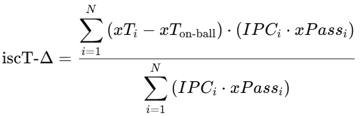
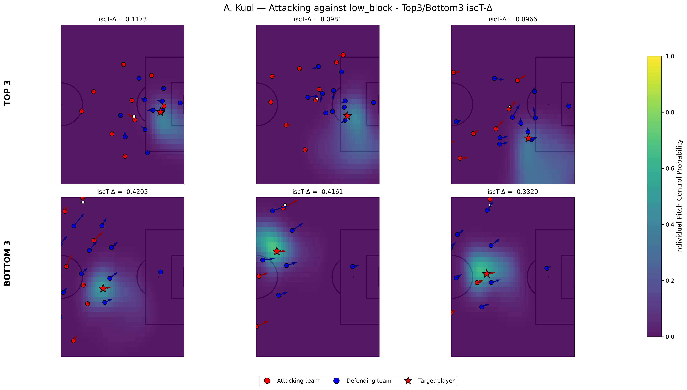

# SkillCorner X PySport Analytics Cup
This repository contains the submission template for the SkillCorner X PySport Analytics Cup **Research Track**. 
Your submission for the **Research Track** should be on the `main` branch of your own fork of this repository.

Find the Analytics Cup [**dataset**](https://github.com/SkillCorner/opendata/tree/master/data) and [**tutorials**](https://github.com/SkillCorner/opendata/tree/master/resources) on the [**SkillCorner Open Data Repository**](https://github.com/SkillCorner/opendata).

## Submitting
Make sure your `main` branch contains:
1. A single Jupyter Notebook in the root of this repository called `submission.ipynb`
    - This Juypter Notebook can not contain more than 2000 words.
    - All other code should also be contained in this repository, but should be imported into the notebook from the `src` folder.
2. An abstract of maximum 500 words that follows the **Research Track Abstract Template**.
    - The abstract can contain a maximum of 2 figures, 2 tables or 1 figure and 1 table.
3. Submit your GitHub repository on the [Analytics Cup Pretalx page](https://pretalx.pysport.org)

Finally:
- Make sure your GitHub repository does **not** contain big data files. The tracking data should be loaded directly from the [Analytics Cup Data GitHub Repository](https://github.com/SkillCorner/opendata).For more information on how to load the data directly from GitHub please see this [Jupyter Notebook](https://github.com/SkillCorner/opendata/blob/master/resources/getting-started-skc-tracking-kloppy.ipynb).
- Make sure the `submission.ipynb` notebook runs on a clean environment.

_⚠️ Not adhering to these submission rules and the [**Analytics Cup Rules**](https://pysport.org/analytics-cup/rules) may result in a point deduction or disqualification._

---

## Research Track Abstract Template (max. 500 words)
#### Introduction
The goal of this project is to propose a **method to analyze and evaluate the spaces controlled by an individual player in specific game situations**.

My initial observation is that most existing studies leveraging Pitch Control models focus on space occupation at team-level, rather than at player-level, while it enables to address several important questions:
- How does a player position himself relative to other players ?
- What types of spaces does a player usually control? 
- Are these controlled spaces realistic (i.e. reachable by a pass) and dangerous (i.e. do they increase the probability of scoring)?

#### Methods
The methodology is structured into three main steps (each time filtering on a specific player_position and game_situation):

**Individual Pitch Control (IPV)**
We compute Pitch Control at the individual level by adapting [William Spearman’s physics-based Pitch Control model](https://www.researchgate.net/publication/334849056_Quantifying_Pitch_Control).
Instead of summing the control probabilities of all players from both teams, we compute the probability of a single player against the sum of the probabilities of the opposing team’s players.

**Spatial categorization of controlled areas**
To better interpret the controlled spaces, we cluster them, with both spatial and contextual features (e.g., defensive lines), using unsupervised learning methods : a K-means model produces coherent spatial zones, and a UMAP-HDBSCAN model allows for a finer characterization of space shapes.

**Evaluation of controlled spaces**
To assess the value of these spaces, we train xPass and xT models based on the [deep-learning Soccermap approach](https://arxiv.org/abs/2010.10202).

We introduce the metric **iscT-Δ — Individual Space Controlled Threat Delta**:
- It is defined as the weighted average of the difference between the xT values of the spaces controlled by the player and the xT of where the ball is, weighted by both the Individual Pitch Control and the xPass probability.
- Intuition: the more likely a player is to control a space — and the more likely a pass into that space is to be successful — the more weight is assigned to the incremental xT gain.

#### Results
- Soccermap models scores : 0.77 AUC for xPass / 0.6 for xT (could be improved a lot with more matches for training).
- Players exhibit very diverse profiles in terms of the types of spaces they control.
- Truly “complete” players are rare (and thus valuable): few players consistently create relevant and dangerous spaces (iscT-Δ) across all game situations (same observation when decomposing a game situation into clusters).
- Example of analysis for player improvement : focus on top3/bottom3 iscT-Δ for a given game situation.

#### Conclusion
This approach is especially relevant for positions that interact less with the ball, such as forwards, because it enables a more holistic evaluation of player performance: players who rarely touch the ball and produce few decisive actions do not necessarily have a poor game. They may still control accessible and dangerous spaces without being served, which in turn could highlight limitations in their teammates’ decision-making.

As a next step, a promising direction would be to integrate this framework into an EPV-based model, enabling a unified valuation with both the opportunity created by controlled spaces and action outcomes.
